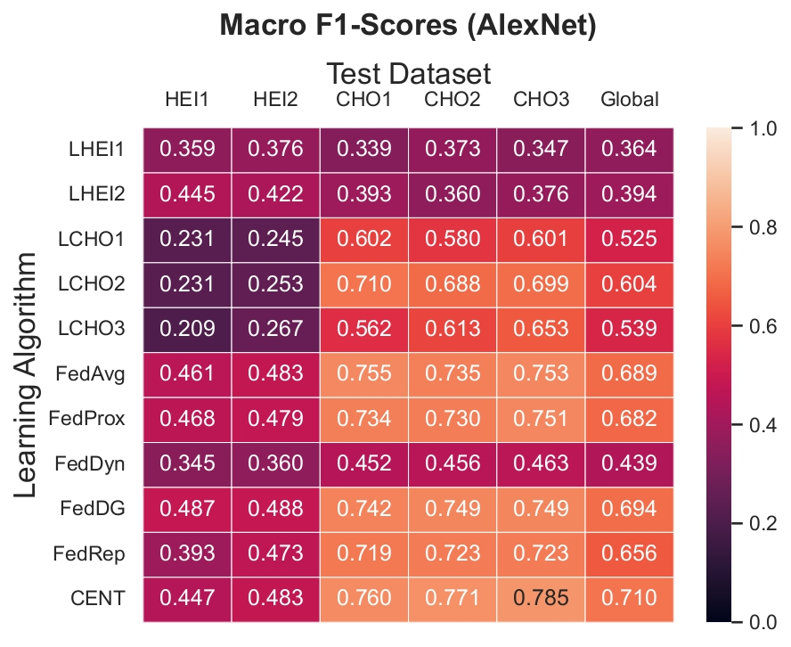
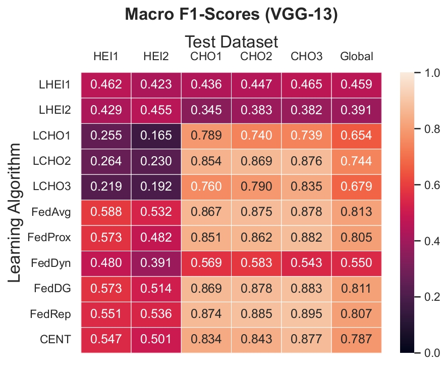
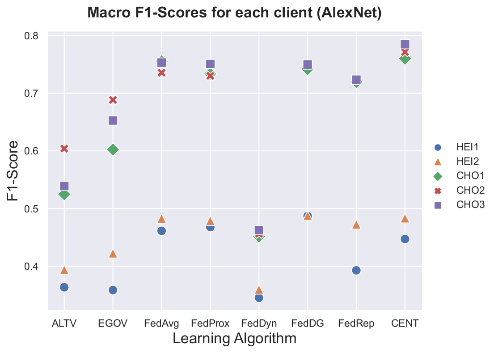
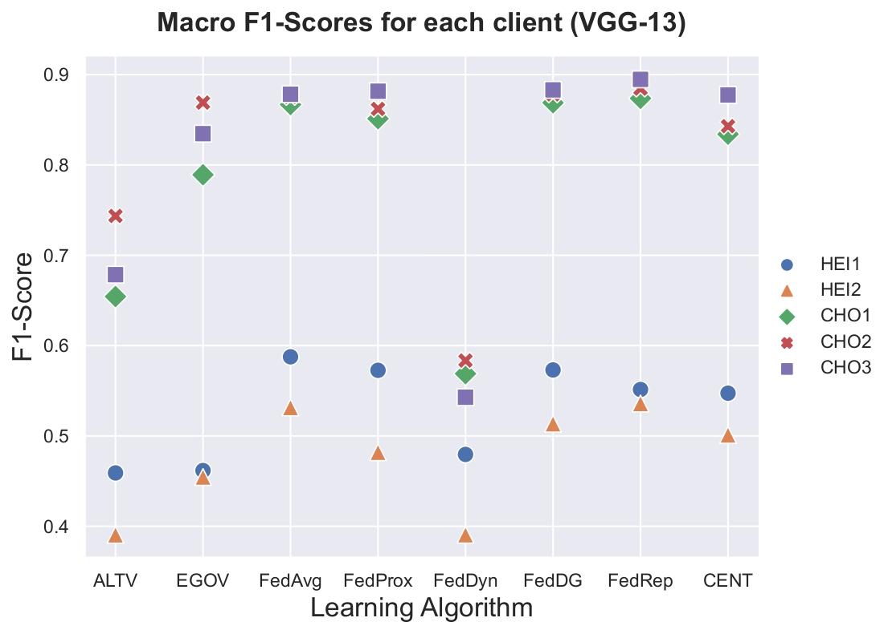

# Investigation of Federated Learning on multicentric surgical video data in terms of the influence on model performance
This repository contains the source code and thesis report of my masters thesis on the topic of "Investigation of Federated Learning on multicentric surgical video data in terms of the influence on model performance" at the Department for Translational Surgical Oncology of the National Center for Tumor Diseases (NCT) Dresden.

# Abstract
The strict regulation of privacy-sensitive personal medical data complicates the ability to
gather extensive multicentric datasets, hindering the ability to train highly-performant
and well-generalizing medical machine learning models. The novel approach of federated
learning decentralizes the training process, allowing several institutions to collaboratively
train a model while keeping the used data stored privately at each institution. The diverse
range of recently published federated learning approaches requires comparative studies
in terms of model performance. Further, comparisons to classical learning procedures,
such as trainings with a centralized dataset and trainings where each institution uses only
its local data, are needed. These are done in this thesis by thoroughly investigating the
performance of federated learning approaches for multiple models on a combination of two
datasets containing surgical video data. We were able to show that most of the considered
federated learning algorithms achieve comparable results with the centralized training
approach on a multi-label classification task and improving clearly over the local only
trainings. Regarding the results of the local trainings, two variants of interpretation are
established and compared, which represent different client motivations. Furthermore, in
this work, performance differences among different institutions of a federation are discussed
and associated with the respective client datasets. For the given task, it was found that
federated learning yields larger improvements for labels that occur less in the data and
that the influence of the considered machine learning model remained small.

AlexNet             |  VGG-13
:-------------------------:|:-------------------------:
 | 
 | 

Above are the performances of the various Federated Learning algorithms for a federation of five clients with individual datasets, concerning the task of multi-label image classification. Given are the F1-Scores of each algorithm for the held-back test datasets of each client individually as well as the combined global test dataset.

# Content
- Master Thesis Report
- classes for different clients and server in a federated setting
- federated learning algorithms for FedAvg, FedProx, FedDyn, FedDG, and FedRep
- utilities including DataLoader, PyTorch model algebraics, data preprocessing, and results storage pipeline
- testing inference with respect to multiple metrics

The code is designed for the two datasets HeiChole and Cholec80:

```
@article{wagner2021comparative,
  title={Comparative Validation of Machine Learning Algorithms for Surgical Workflow and Skill Analysis with the HeiChole Benchmark},
  author={Wagner, Martin and M{\"u}ller-Stich, Beat-Peter and Kisilenko, Anna and Tran, Duc and Heger, Patrick and M{\"u}ndermann, Lars and Lubotsky, David M and M{\"u}ller, Benjamin and Davitashvili, Tornike and Capek, Manuela and others},
  journal={arXiv preprint arXiv:2109.14956},
  year={2021}
}

@article{twinanda2016endonet,
  title={Endonet: a deep architecture for recognition tasks on laparoscopic videos},
  author={Twinanda, Andru P and Shehata, Sherif and Mutter, Didier and Marescaux, Jacques and De Mathelin, Michel and Padoy, Nicolas},
  journal={IEEE transactions on medical imaging},
  volume={36},
  number={1},
  pages={86--97},
  year={2016},
  publisher={IEEE}
}
```
